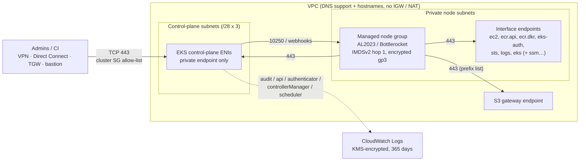

# Secure, private Amazon EKS

A Terraform module for an EKS cluster with no public attack surface. The Kubernetes API is reachable only from inside the VPC or from networks you allow. Nodes run in private subnets with default-deny egress. Every data store is encrypted with a customer managed KMS key, and identity is handled entirely through EKS access entries and Pod Identity.

The module uses raw `aws_*` resources and does not wrap another EKS module, so every security-relevant setting is visible and reviewable. It needs no `kubernetes` or `helm` provider, so you can apply it from outside the VPC even though the API endpoint is private.

## Architecture



## Security controls

| Area | Control | How |
|---|---|---|
| API endpoint | Private only (CIS 5.4.1/5.4.2) | `endpoint_private_access = true`, `endpoint_public_access = false`, hard-coded |
| API endpoint | Who can connect | Module security group on the control-plane ENIs: TCP 443 only from nodes, `cluster_endpoint_allowed_cidr_blocks` (0.0.0.0/0 rejected) and `cluster_endpoint_allowed_security_group_ids` |
| Authentication | Access entries only (CIS 4.1.7, 5.5.1) | `authentication_mode = "API"`; no `aws-auth` ConfigMap |
| Authorization | No implicit cluster-admin (CIS 4.1.1) | `bootstrap_cluster_creator_admin_permissions = false`; admins listed in `access_entries` |
| Encryption | Kubernetes API data under your CMK (CIS 5.3.1) | `encryption_config` with a dedicated rotating KMS key (or `create_kms_key = false` + `kms_key_arn`) |
| Encryption | Logs and volumes | Separate rotating CMKs for the log group (scoped to that log group by encryption context) and node EBS volumes |
| Encryption | Keys can't be swapped out from under data | Key ARNs are frozen at creation, and every consumer (cluster, log group, launch templates, CSI policy) reads the frozen value. A changed `create_*_kms_key` flag, or a changed ARN known at plan time, fails the plan. An ARN only known at apply fails the apply before anything is re-keyed. Without this, Terraform would schedule the in-use key for deletion while EKS kept using it |
| Audit | All five control-plane log types (CIS 2.1.1) | Pre-created `/aws/eks/<name>/cluster` log group: KMS-encrypted, 365-day retention |
| Detection | Optional audit-log alarms | `enable_audit_log_metric_filters` + `audit_log_alarm_sns_topic_arns` |
| Nodes | Credential theft from pods | IMDSv2 required, hop limit 1: pods cannot reach node-role credentials |
| Nodes | No remote shell by default | No SSH keys or `remote_access`; optional Session Manager with the minimal best-practice policy |
| Nodes | Hardened OS | AL2023 or Bottlerocket only (AL2 rejected). On Bottlerocket the admin container is disabled and kernel lockdown is `integrity` |
| Nodes | Private nodes (CIS 5.4.3) | Plan fails if a node subnet auto-assigns public IPv4 addresses; launch templates set no network interfaces or SSH keys |
| Nodes | Self-healing | Node auto repair plus the node monitoring agent |
| Network | Default-deny egress | Node SG egress only to nodes, the API server, HTTPS in the VPC (endpoints) and the S3 prefix list |
| Network | Endpoint data perimeter (optional) | `modules/vpc-endpoints` `data_perimeter`: endpoints only admit this account's or org's principals, and S3 only reaches its buckets (plus ECR layers) |
| Network | Pod-level policy (CIS 4.3.1/5.4.4) | VPC CNI network policy enforcement on; optional strict default-deny mode |
| IAM | Least-privilege add-ons (CIS 5.2.1) | vpc-cni and EBS CSI use dedicated Pod Identity roles scoped to their service account, namespace and cluster. EBS CSI uses the cluster-scoped managed policy. The node role has no CNI permissions |
| IAM | No policy drift | Managed policies on module roles are attached with `aws_iam_role_policy_attachments_exclusive`: out-of-band attachments are removed, and an unknown policy set never turns into create-then-destroy replacements that detach the policy |
| IAM | Pull-only registry access (CIS 5.1.3) | `AmazonEC2ContainerRegistryPullOnly` on the node role |
| IAM | Confused-deputy protection | Cluster role trust limited by `aws:SourceAccount` / `aws:SourceArn` |
| Lifecycle | Accidental deletion | `deletion_protection = true` by default. EKS refuses to delete the cluster. A destroy guard also stops `terraform destroy` before it touches anything the module manages, or anything passed in `node_group_dependencies` / `deletion_guard_dependencies` |
| Lifecycle | Cost and patching | `upgrade_policy = STANDARD` (the EKS API default is EXTENDED) |

Static analysis: `trivy config` and `checkov` both pass with zero findings on the module, the submodule and the example. Inline suppressions are listed under [Static analysis](#static-analysis).

## Prerequisites

1. **VPC DNS.** `enableDnsSupport` and `enableDnsHostnames` must be on, and the DHCP options must include `AmazonProvidedDNS`. The module checks the first two at plan time.
2. **Private subnets.** Subnets for nodes, plus (recommended) dedicated `/28` subnets for the control-plane ENIs, each spread over at least two AZs. The plan fails if a node subnet auto-assigns public IPs, or if a control-plane subnet is in an AZ that EKS rejects (`use1-az3`, `usw1-az2`, `cac1-az3`).
3. **VPC endpoints** when nodes have no NAT. Use [`modules/vpc-endpoints`](modules/vpc-endpoints) or your shared endpoints.

   | Endpoint | Why | Needed |
   |---|---|---|
   | `ec2` | nodeadm node naming, VPC CNI ENI management, EBS CSI | always |
   | `ecr.api`, `ecr.dkr` + S3 gateway | Add-on and workload image pulls (layers live in S3) | always |
   | `eks-auth` | Pod Identity: the vpc-cni and EBS CSI credentials | always (with default settings) |
   | `sts` | IRSA, SDKs using regional STS | if `enable_irsa` or IRSA workloads |
   | `logs` | Fluent Bit / CloudWatch agent | if shipping node or pod logs |
   | `eks` | EKS API from inside the VPC (CI runners, `update-kubeconfig`) | if Terraform/CI runs in the VPC |
   | `ssm`, `ssmmessages` | Session Manager | if `enable_node_ssm_access` |
   | `elasticloadbalancing`, `autoscaling`, `guardduty-data`, … | AWS Load Balancer Controller, Cluster Autoscaler, GuardDuty agent | per add-on |

4. **AutoScaling service-linked role.** The EBS key policy names `AWSServiceRoleForAutoScaling`. It exists in any account that has ever used EC2 Auto Scaling. In a brand-new account, set `create_autoscaling_service_linked_role = true` once.
5. **A network path to the API** for `kubectl` (see [Reaching the cluster](#reaching-the-cluster)). Terraform itself does not need one.
6. **No `depends_on` on the module call.** A module-level `depends_on` defers every data source inside the module, so most values are unknown at plan and resources are needlessly replaced. To make nodes wait for something, such as VPC endpoints created in the same configuration, pass its IDs in `node_group_dependencies`. `modules/vpc-endpoints` exports `dependency_ids` for this.

## Usage

```hcl
module "eks" {
  source = "git::https://example.com/your-org/tf-eks.git?ref=v1.0.0"

  name               = "payments-prod"
  kubernetes_version = "1.37"

  vpc_id                   = "vpc-0123456789abcdef0"
  node_subnet_ids          = ["subnet-aaa", "subnet-bbb", "subnet-ccc"]
  control_plane_subnet_ids = ["subnet-ddd", "subnet-eee", "subnet-fff"]

  cluster_endpoint_allowed_cidr_blocks = ["10.100.0.0/16"] # corporate VPN
  service_ipv4_cidr                    = "172.20.0.0/16"   # must not overlap connected networks

  # Nodes in a no-NAT VPC need the endpoints before they boot, and the endpoints
  # should sit behind the destroy guard too.
  node_group_dependencies     = module.vpc_endpoints.dependency_ids
  deletion_guard_dependencies = module.vpc_endpoints.dependency_ids

  access_entries = {
    platform_admins = {
      principal_arn = "arn:aws:iam::111122223333:role/PlatformAdmin"
      policy_associations = {
        admin = {
          policy_arn   = "arn:aws:eks::aws:cluster-access-policy/AmazonEKSClusterAdminPolicy"
          access_scope = { type = "cluster" }
        }
      }
    }
    payments_devs = {
      principal_arn = "arn:aws:iam::111122223333:role/PaymentsDeveloper"
      policy_associations = {
        edit = {
          policy_arn   = "arn:aws:eks::aws:cluster-access-policy/AmazonEKSEditPolicy"
          access_scope = { type = "namespace", namespaces = ["payments"] }
        }
      }
    }
  }

  node_groups = {
    system = {
      ami_type     = "BOTTLEROCKET_ARM_64"
      min_size     = 2
      max_size     = 4
      desired_size = 2
      taints       = [{ key = "CriticalAddonsOnly", value = "true", effect = "NO_SCHEDULE" }]
    }
    apps = {
      ami_type       = "AL2023_x86_64_STANDARD"
      instance_types = ["m7i.xlarge", "m6i.xlarge"]
      capacity_type  = "SPOT"
      min_size       = 2
      max_size       = 20
      desired_size   = 3
    }
  }
}
```

[`examples/complete`](examples/complete) builds everything end to end: a VPC with no NAT, dedicated control-plane subnets, flow logs, the endpoints, and the cluster.

## Reaching the cluster

The endpoint resolves (from public DNS too) to private IPs in the VPC. Pick one way to get packets there:

- **VPN, Direct Connect, TGW or peering.** Add the source ranges to `cluster_endpoint_allowed_cidr_blocks`.
- **Bastion or CI runner in the VPC.** Add its security group to `cluster_endpoint_allowed_security_group_ids`.
- **SSM port forwarding** through an SSM-managed instance in the VPC: a node (with `enable_node_ssm_access`), or an instance whose security group is in `cluster_endpoint_allowed_security_group_ids`:

  ```bash
  aws ssm start-session --target i-0123456789abcdef0 --document-name AWS-StartPortForwardingSessionToRemoteHost --parameters '{"host":["<endpoint-host>"],"portNumber":["443"],"localPortNumber":["8443"]}'
  ```

  Then point kubeconfig at `https://localhost:8443` with `tls-server-name: <endpoint-host>`.
- **AWS CloudShell VPC environment** in the cluster VPC.

Then run the `kubeconfig_command` output. Grant the IAM principal you use an access entry before you need it: there is no fallback admin.

## Design notes

- **Security groups.** EKS's own cluster security group is left alone. The module attaches its own groups instead: one to the control-plane ENIs and one to nodes through the launch templates. Setting groups in the launch template stops EKS from also attaching its cluster SG to nodes. That keeps exactly one `kubernetes.io/cluster/<name>`-tagged group per ENI, which the AWS Load Balancer Controller requires.
- **Restricted egress.** Pod traffic carries the node SG, so node egress rules are also pod egress rules. Add destinations (databases, internal services, an egress proxy) with `node_security_group_additional_rules`, or set `node_security_group_allow_all_egress = true` if the VPC has a NAT or firewall path.
- **IMDS hop limit 1.** Pods cannot read node credentials, region or VPC ID from IMDS. Give workloads the region explicitly: Pod Identity does not inject `AWS_REGION`. For the AWS Load Balancer Controller, set the Helm values `region` and `vpcId`.
- **Add-on ordering.** `bootstrap_self_managed_addons = false`, so EKS installs nothing unmanaged. DaemonSet add-ons (pod identity agent, vpc-cni, kube-proxy, node monitoring agent) are created before the node groups, so nodes join with networking and credentials in place. coredns and the EBS CSI controller come after, because Deployments stay `DEGRADED` until nodes exist. The networking and DNS add-ons are `preserve = true`: deleting the add-on resource never deletes the running aws-node, kube-proxy, pod identity agent or CoreDNS.
- **Pod Identity over IRSA.** vpc-cni and EBS CSI use Pod Identity, which needs no OIDC reachability. Turn on `enable_irsa` only for workloads that need IRSA.
- **Add-on versions.** Unpinned add-ons use the EKS *default* version for `kubernetes_version`, so plans stay stable and upgrades happen together with control-plane upgrades. Set `addons.<name>.version` to pin a version, or `most_recent = true` to track the newest build.

## Operations

**Upgrading Kubernetes.** Raise `kubernetes_version` by one minor version and apply. Terraform upgrades the control plane first, then the add-ons (moved to the new default versions), then the node groups, which roll through `max_unavailable_percentage`. vpc-cni and the pod identity agent only allow one minor version per update. If an add-on is pinned, move it one step at a time. To upgrade in stages, first set `data_plane_kubernetes_version` to the old version, then remove it in a later apply.

**Rolling back an upgrade** (EKS allows one minor version back, within 7 days). EKS requires the data plane to go back first. First apply `data_plane_kubernetes_version = "<previous>"`, which rolls the node groups back and resolves add-on versions for the previous version. Then set `kubernetes_version` to the previous version, remove `data_plane_kubernetes_version`, and apply again.

**Node AMI updates.** Unpinned node groups get the latest AMI when they are created, when the Kubernetes version changes, and whenever their launch template changes (`tags`, disk settings, `bootstrap_extra_config`, security groups). Any launch template change therefore rolls every node in that group. To roll a specific AMI, set `release_version`. AL2023 pins must start with the node Kubernetes version, so move the pin in the same change as an upgrade.

**Replacing node groups.** Changing `ami_type`, `instance_types`, `capacity_type` or `subnet_ids` creates a new node group before the old one is removed. The new group starts at the configured `desired_size`, not at what the autoscaler had scaled to. Raise `desired_size` to the current capacity first, or add a new map key, migrate workloads, and then remove the old key. `desired_size` is otherwise ignored after creation, so the Cluster Autoscaler or Karpenter owns it.

**Create-time settings.** These cannot be changed on a running cluster. The cluster and log group names are fixed, so Terraform cannot replace them either; changing them means building a new cluster.

| Setting | Why |
|---|---|
| `name`, `service_ipv4_cidr`, `ip_family` | EKS create-time attributes |
| `control_plane_egress_mode` → `CUSTOMER_ROUTED` | One-way in EKS |
| `cloudwatch_log_group_class` | CloudWatch create-time attribute |
| `upgrade_support_type` | Cannot leave EXTENDED once the cluster is in extended support |
| `create_kms_key` / `kms_key_arn` | EKS cannot re-key; the key guards refuse the change |
| Add-on `before_compute` | Moves the add-on between resources; use a `moved` block |

**Switching the logs or EBS key** (the cluster key can never change). Old logs, volumes and snapshots stay encrypted with the old key, so it must survive:

1. If the module created the old key, run `terraform state rm` on it and its alias (`module.<name>.aws_kms_key.ebs[0]`, `module.<name>.aws_kms_alias.ebs[0]`), so Terraform never schedules it for deletion.
2. For EBS, add the old key ARN to `ebs_csi_additional_kms_key_arns`, so the CSI driver can still attach existing volumes. Keep it there until every volume and snapshot on the old key is migrated or deleted.
3. Set the new key inputs and re-baseline that key's guard (and the ownership guard if a `create_*_kms_key` flag changed): `terraform apply -replace='module.<name>.terraform_data.kms_key_guard["ebs"]' -replace='module.<name>.terraform_data.kms_key_ownership'`. Use `["logs"]` for the logs key. Only that key's consumers are updated.

An EBS key switch changes every launch template, so every node rolls in that apply.

**Destroying.** Apply with `deletion_protection = false` first, then `terraform destroy`. While protection is on, the destroy guard (a `local-exec` that needs a shell on the runner) fails the destroy before any module resource is deleted. The same holds for anything passed in `node_group_dependencies` or `deletion_guard_dependencies`. Other caller resources that only reference module outputs (Helm releases, pod identity associations) are destroyed in parallel unless you pass their IDs in `deletion_guard_dependencies`. Removing the module block skips the guard; EKS deletion protection still applies. The KMS keys enter their deletion window (30 days by default) and can be recovered within it.

## Static analysis

Run against the module root with trivy 0.75 and checkov 3.3:

```bash
trivy config --severity HIGH,CRITICAL .
```

```bash
checkov -d . --framework terraform
```

Inline suppressions, each with a reason in the code:

| Check | Where | Why |
|---|---|---|
| `CKV_AWS_339` | `aws_eks_cluster` | Checkov's supported-version list stops at 1.35; EKS standard support is 1.34-1.37 |
| `CKV_AWS_109/111/356` | KMS key policy documents | In a key policy, `Resource "*"` means the key itself |
| `CKV_AWS_111/356` | SSM and IPv6 CNI policies | Those actions do not support resource-level permissions |
| `CKV_AWS_382`, `AWS-0104` | Opt-in allow-all egress rules | Only created when `node_security_group_allow_all_egress = true` |
| `CKV_AWS_1/49` | `modules/vpc-endpoints` perimeter policy | Resource-based endpoint policy; `"*"` is limited by the principal-account/org condition |
| `CKV_TF_1`, `CKV_AWS_394`, KMS policy checks | `examples/complete` | Registry module pinned by version; AZs chosen dynamically with EKS-unsupported zone IDs excluded |

## Testing

```bash
terraform init -backend=false && terraform test
```

```bash
cd modules/vpc-endpoints && terraform init -backend=false && terraform test
```

The tests mock the AWS provider, so they need no credentials:

- `tests/unit.tftest.hcl` (plan only) asserts the security defaults, the trust-policy and key-policy conditions, and the main guard rails (validations and preconditions).
- `tests/lifecycle.tftest.hcl` applies against mocks, then shows both key guards refusing key switches. That includes handing the module's own key over as a caller key, which the ARN comparison alone misses.
- `modules/vpc-endpoints/tests` covers the endpoint set, the data perimeter, and resetting the policies when the perimeter is turned off.

Mocks cannot prove AWS-side behaviour such as EKS add-on health, node bootstrap through the endpoints, or KMS grants. Validate those with a real `examples/complete` deployment.

<!-- BEGIN_TF_DOCS -->
## Requirements

| Name | Version |
| ---- | ------- |
| <a name="requirement_terraform"></a> [terraform](#requirement\_terraform) | >= 1.10 |
| <a name="requirement_aws"></a> [aws](#requirement\_aws) | >= 6.67, < 7.0 |

## Providers

| Name | Version |
| ---- | ------- |
| <a name="provider_aws"></a> [aws](#provider\_aws) | >= 6.67, < 7.0 |
| <a name="provider_terraform"></a> [terraform](#provider\_terraform) | n/a |

## Resources

| Name | Type |
| ---- | ---- |
| [aws_cloudwatch_log_group.this](https://registry.terraform.io/providers/hashicorp/aws/latest/docs/resources/cloudwatch_log_group) | resource |
| [aws_cloudwatch_log_metric_filter.audit](https://registry.terraform.io/providers/hashicorp/aws/latest/docs/resources/cloudwatch_log_metric_filter) | resource |
| [aws_cloudwatch_metric_alarm.audit](https://registry.terraform.io/providers/hashicorp/aws/latest/docs/resources/cloudwatch_metric_alarm) | resource |
| [aws_eks_access_entry.this](https://registry.terraform.io/providers/hashicorp/aws/latest/docs/resources/eks_access_entry) | resource |
| [aws_eks_access_policy_association.this](https://registry.terraform.io/providers/hashicorp/aws/latest/docs/resources/eks_access_policy_association) | resource |
| [aws_eks_addon.before_compute](https://registry.terraform.io/providers/hashicorp/aws/latest/docs/resources/eks_addon) | resource |
| [aws_eks_addon.this](https://registry.terraform.io/providers/hashicorp/aws/latest/docs/resources/eks_addon) | resource |
| [aws_eks_cluster.this](https://registry.terraform.io/providers/hashicorp/aws/latest/docs/resources/eks_cluster) | resource |
| [aws_eks_node_group.this](https://registry.terraform.io/providers/hashicorp/aws/latest/docs/resources/eks_node_group) | resource |
| [aws_iam_openid_connect_provider.this](https://registry.terraform.io/providers/hashicorp/aws/latest/docs/resources/iam_openid_connect_provider) | resource |
| [aws_iam_policy.cni_ipv6](https://registry.terraform.io/providers/hashicorp/aws/latest/docs/resources/iam_policy) | resource |
| [aws_iam_role.cluster](https://registry.terraform.io/providers/hashicorp/aws/latest/docs/resources/iam_role) | resource |
| [aws_iam_role.node](https://registry.terraform.io/providers/hashicorp/aws/latest/docs/resources/iam_role) | resource |
| [aws_iam_role.pod_identity](https://registry.terraform.io/providers/hashicorp/aws/latest/docs/resources/iam_role) | resource |
| [aws_iam_role_policy.cluster_kms](https://registry.terraform.io/providers/hashicorp/aws/latest/docs/resources/iam_role_policy) | resource |
| [aws_iam_role_policy.ebs_csi_kms](https://registry.terraform.io/providers/hashicorp/aws/latest/docs/resources/iam_role_policy) | resource |
| [aws_iam_role_policy.node_ssm](https://registry.terraform.io/providers/hashicorp/aws/latest/docs/resources/iam_role_policy) | resource |
| [aws_iam_role_policy_attachments_exclusive.cluster](https://registry.terraform.io/providers/hashicorp/aws/latest/docs/resources/iam_role_policy_attachments_exclusive) | resource |
| [aws_iam_role_policy_attachments_exclusive.node](https://registry.terraform.io/providers/hashicorp/aws/latest/docs/resources/iam_role_policy_attachments_exclusive) | resource |
| [aws_iam_role_policy_attachments_exclusive.pod_identity](https://registry.terraform.io/providers/hashicorp/aws/latest/docs/resources/iam_role_policy_attachments_exclusive) | resource |
| [aws_iam_service_linked_role.autoscaling](https://registry.terraform.io/providers/hashicorp/aws/latest/docs/resources/iam_service_linked_role) | resource |
| [aws_kms_alias.cluster](https://registry.terraform.io/providers/hashicorp/aws/latest/docs/resources/kms_alias) | resource |
| [aws_kms_alias.ebs](https://registry.terraform.io/providers/hashicorp/aws/latest/docs/resources/kms_alias) | resource |
| [aws_kms_alias.logs](https://registry.terraform.io/providers/hashicorp/aws/latest/docs/resources/kms_alias) | resource |
| [aws_kms_key.cluster](https://registry.terraform.io/providers/hashicorp/aws/latest/docs/resources/kms_key) | resource |
| [aws_kms_key.ebs](https://registry.terraform.io/providers/hashicorp/aws/latest/docs/resources/kms_key) | resource |
| [aws_kms_key.logs](https://registry.terraform.io/providers/hashicorp/aws/latest/docs/resources/kms_key) | resource |
| [aws_launch_template.node](https://registry.terraform.io/providers/hashicorp/aws/latest/docs/resources/launch_template) | resource |
| [aws_security_group.cluster](https://registry.terraform.io/providers/hashicorp/aws/latest/docs/resources/security_group) | resource |
| [aws_security_group.node](https://registry.terraform.io/providers/hashicorp/aws/latest/docs/resources/security_group) | resource |
| [aws_vpc_security_group_egress_rule.cluster](https://registry.terraform.io/providers/hashicorp/aws/latest/docs/resources/vpc_security_group_egress_rule) | resource |
| [aws_vpc_security_group_egress_rule.node](https://registry.terraform.io/providers/hashicorp/aws/latest/docs/resources/vpc_security_group_egress_rule) | resource |
| [aws_vpc_security_group_egress_rule.node_all_ipv4](https://registry.terraform.io/providers/hashicorp/aws/latest/docs/resources/vpc_security_group_egress_rule) | resource |
| [aws_vpc_security_group_egress_rule.node_all_ipv6](https://registry.terraform.io/providers/hashicorp/aws/latest/docs/resources/vpc_security_group_egress_rule) | resource |
| [aws_vpc_security_group_ingress_rule.cluster](https://registry.terraform.io/providers/hashicorp/aws/latest/docs/resources/vpc_security_group_ingress_rule) | resource |
| [aws_vpc_security_group_ingress_rule.node](https://registry.terraform.io/providers/hashicorp/aws/latest/docs/resources/vpc_security_group_ingress_rule) | resource |
| [terraform_data.deletion_guard](https://registry.terraform.io/providers/hashicorp/terraform/latest/docs/resources/data) | resource |
| [terraform_data.kms_key_guard](https://registry.terraform.io/providers/hashicorp/terraform/latest/docs/resources/data) | resource |
| [terraform_data.kms_key_ownership](https://registry.terraform.io/providers/hashicorp/terraform/latest/docs/resources/data) | resource |
| [terraform_data.node_group_dependencies](https://registry.terraform.io/providers/hashicorp/terraform/latest/docs/resources/data) | resource |
| [terraform_data.node_policy_arns](https://registry.terraform.io/providers/hashicorp/terraform/latest/docs/resources/data) | resource |
| [aws_caller_identity.current](https://registry.terraform.io/providers/hashicorp/aws/latest/docs/data-sources/caller_identity) | data source |
| [aws_ec2_managed_prefix_list.s3](https://registry.terraform.io/providers/hashicorp/aws/latest/docs/data-sources/ec2_managed_prefix_list) | data source |
| [aws_eks_addon_version.this](https://registry.terraform.io/providers/hashicorp/aws/latest/docs/data-sources/eks_addon_version) | data source |
| [aws_iam_policy.ebs_csi](https://registry.terraform.io/providers/hashicorp/aws/latest/docs/data-sources/iam_policy) | data source |
| [aws_iam_policy_document.cluster_assume_role](https://registry.terraform.io/providers/hashicorp/aws/latest/docs/data-sources/iam_policy_document) | data source |
| [aws_iam_policy_document.cluster_kms](https://registry.terraform.io/providers/hashicorp/aws/latest/docs/data-sources/iam_policy_document) | data source |
| [aws_iam_policy_document.cni_ipv6](https://registry.terraform.io/providers/hashicorp/aws/latest/docs/data-sources/iam_policy_document) | data source |
| [aws_iam_policy_document.ebs_csi_kms](https://registry.terraform.io/providers/hashicorp/aws/latest/docs/data-sources/iam_policy_document) | data source |
| [aws_iam_policy_document.ebs_kms](https://registry.terraform.io/providers/hashicorp/aws/latest/docs/data-sources/iam_policy_document) | data source |
| [aws_iam_policy_document.kms_base](https://registry.terraform.io/providers/hashicorp/aws/latest/docs/data-sources/iam_policy_document) | data source |
| [aws_iam_policy_document.logs_kms](https://registry.terraform.io/providers/hashicorp/aws/latest/docs/data-sources/iam_policy_document) | data source |
| [aws_iam_policy_document.node_assume_role](https://registry.terraform.io/providers/hashicorp/aws/latest/docs/data-sources/iam_policy_document) | data source |
| [aws_iam_policy_document.node_ssm](https://registry.terraform.io/providers/hashicorp/aws/latest/docs/data-sources/iam_policy_document) | data source |
| [aws_iam_policy_document.pod_identity_assume_role](https://registry.terraform.io/providers/hashicorp/aws/latest/docs/data-sources/iam_policy_document) | data source |
| [aws_iam_session_context.current](https://registry.terraform.io/providers/hashicorp/aws/latest/docs/data-sources/iam_session_context) | data source |
| [aws_partition.current](https://registry.terraform.io/providers/hashicorp/aws/latest/docs/data-sources/partition) | data source |
| [aws_region.current](https://registry.terraform.io/providers/hashicorp/aws/latest/docs/data-sources/region) | data source |
| [aws_subnets.control_plane_unsupported_az](https://registry.terraform.io/providers/hashicorp/aws/latest/docs/data-sources/subnets) | data source |
| [aws_subnets.node_public_ip](https://registry.terraform.io/providers/hashicorp/aws/latest/docs/data-sources/subnets) | data source |
| [aws_vpc.this](https://registry.terraform.io/providers/hashicorp/aws/latest/docs/data-sources/vpc) | data source |
| [aws_vpc_endpoint_service.s3](https://registry.terraform.io/providers/hashicorp/aws/latest/docs/data-sources/vpc_endpoint_service) | data source |

## Inputs

| Name | Description | Type | Default | Required |
| ---- | ----------- | ---- | ------- | :------: |
| <a name="input_kubernetes_version"></a> [kubernetes\_version](#input\_kubernetes\_version) | Kubernetes <major>.<minor> version for the control plane and node groups, e.g. "1.37". Required on purpose: a module default that changed between releases would silently upgrade clusters. | `string` | n/a | yes |
| <a name="input_name"></a> [name](#input\_name) | Name of the EKS cluster. Also used to name and prefix every resource the module creates. | `string` | n/a | yes |
| <a name="input_node_subnet_ids"></a> [node\_subnet\_ids](#input\_node\_subnet\_ids) | Private subnet IDs for worker nodes. Also used for the control-plane ENIs when control\_plane\_subnet\_ids is empty. Do not use subnets that route to an internet gateway. | `list(string)` | n/a | yes |
| <a name="input_vpc_id"></a> [vpc\_id](#input\_vpc\_id) | ID of the VPC. It must have enableDnsSupport and enableDnsHostnames turned on, and its DHCP options must include AmazonProvidedDNS, so the EKS-managed private hosted zone and interface-endpoint private DNS resolve. | `string` | n/a | yes |
| <a name="input_access_entries"></a> [access\_entries](#input\_access\_entries) | EKS access entries to create, keyed by a short name. Do not add entries for node group roles: EKS creates those. Each policy association grants an AWS-managed access policy (arn:<partition>:eks::aws:cluster-access-policy/...) at cluster or namespace scope. | <pre>map(object({<br/>    principal_arn     = string<br/>    type              = optional(string, "STANDARD")<br/>    kubernetes_groups = optional(list(string))<br/>    user_name         = optional(string)<br/>    tags              = optional(map(string), {})<br/>    policy_associations = optional(map(object({<br/>      policy_arn = string<br/>      access_scope = object({<br/>        type       = string<br/>        namespaces = optional(list(string))<br/>      })<br/>    })), {})<br/>  }))</pre> | `{}` | no |
| <a name="input_addons"></a> [addons](#input\_addons) | Overrides and additions for EKS managed add-ons, merged over the module's core set (eks-pod-identity-agent, vpc-cni, kube-proxy, coredns, eks-node-monitoring-agent, aws-ebs-csi-driver).<br/>Unset fields keep the module default. Set enabled = false to drop a core add-on (the core networking add-ons are preserved: their workloads keep running until you delete them).<br/>before\_compute = true creates an extra add-on before node groups; use it only for DaemonSets that must run before workloads. It is create-time only<br/>(changing it moves the add-on between two resources; use a moved block) and cannot be overridden for core add-ons.<br/>version null pins the EKS default version for kubernetes\_version (most\_recent = true picks the newest instead, which drifts as AWS publishes builds). | <pre>map(object({<br/>    enabled                      = optional(bool)<br/>    version                      = optional(string)<br/>    most_recent                  = optional(bool)<br/>    configuration_values         = optional(string)<br/>    before_compute               = optional(bool)<br/>    pod_identity_role_arn        = optional(string)<br/>    pod_identity_service_account = optional(string)<br/>    resolve_conflicts_on_create  = optional(string)<br/>    resolve_conflicts_on_update  = optional(string)<br/>    preserve                     = optional(bool)<br/>  }))</pre> | `{}` | no |
| <a name="input_attach_cni_policy_to_node_role"></a> [attach\_cni\_policy\_to\_node\_role](#input\_attach\_cni\_policy\_to\_node\_role) | Also attach the VPC CNI policy to the node role. Off by default: the vpc-cni add-on gets its own Pod Identity role, so no other pod inherits ENI management permissions. Turn on only for migrations, or when the eks-auth endpoint is unavailable. | `bool` | `false` | no |
| <a name="input_audit_log_additional_metric_filters"></a> [audit\_log\_additional\_metric\_filters](#input\_audit\_log\_additional\_metric\_filters) | Extra audit-log metric filters merged with the module defaults. pattern uses CloudWatch Logs filter syntax against the JSON audit event. | <pre>map(object({<br/>    pattern     = string<br/>    description = string<br/>    threshold   = optional(number, 1)<br/>    period      = optional(number, 300)<br/>  }))</pre> | `{}` | no |
| <a name="input_audit_log_alarm_sns_topic_arns"></a> [audit\_log\_alarm\_sns\_topic\_arns](#input\_audit\_log\_alarm\_sns\_topic\_arns) | SNS topic ARNs notified when an audit-log metric filter fires. Empty creates the metric filters without alarms. | `list(string)` | `[]` | no |
| <a name="input_cloudwatch_log_group_class"></a> [cloudwatch\_log\_group\_class](#input\_cloudwatch\_log\_group\_class) | Log class for the control-plane log group. STANDARD supports metric filters and subscriptions; INFREQUENT\_ACCESS is cheaper but does not. Create-time only: CloudWatch cannot change it, and the fixed log group name prevents replacement. | `string` | `"STANDARD"` | no |
| <a name="input_cloudwatch_log_group_deletion_protection"></a> [cloudwatch\_log\_group\_deletion\_protection](#input\_cloudwatch\_log\_group\_deletion\_protection) | Prevent deletion of the control-plane log group. Leave false if you need terraform destroy to work without manual steps. | `bool` | `false` | no |
| <a name="input_cloudwatch_log_group_kms_key_arn"></a> [cloudwatch\_log\_group\_kms\_key\_arn](#input\_cloudwatch\_log\_group\_kms\_key\_arn) | ARN of an existing KMS key for the control-plane log group, when create\_cloudwatch\_log\_group\_kms\_key is false. The key policy must already let logs.<region>.amazonaws.com use it for this log group. | `string` | `null` | no |
| <a name="input_cloudwatch_log_group_retention_in_days"></a> [cloudwatch\_log\_group\_retention\_in\_days](#input\_cloudwatch\_log\_group\_retention\_in\_days) | Retention for the /aws/eks/<name>/cluster log group. 0 keeps logs forever. The default of 365 days meets checkov CKV\_AWS\_338. | `number` | `365` | no |
| <a name="input_cluster_enabled_log_types"></a> [cluster\_enabled\_log\_types](#input\_cluster\_enabled\_log\_types) | Control-plane log types sent to CloudWatch Logs. All five are enabled by default (CIS EKS 2.1.1, trivy AWS-0038, checkov CKV\_AWS\_37). audit and authenticator are mandatory. | `list(string)` | <pre>[<br/>  "api",<br/>  "audit",<br/>  "authenticator",<br/>  "controllerManager",<br/>  "scheduler"<br/>]</pre> | no |
| <a name="input_cluster_endpoint_allowed_cidr_blocks"></a> [cluster\_endpoint\_allowed\_cidr\_blocks](#input\_cluster\_endpoint\_allowed\_cidr\_blocks) | CIDR blocks (VPN, Direct Connect, peered VPCs, CI runners) allowed to reach the private API endpoint on TCP 443. Nodes are always allowed. | `list(string)` | `[]` | no |
| <a name="input_cluster_endpoint_allowed_security_group_ids"></a> [cluster\_endpoint\_allowed\_security\_group\_ids](#input\_cluster\_endpoint\_allowed\_security\_group\_ids) | Security group IDs (bastions, CI runners in the same VPC) allowed to reach the private API endpoint on TCP 443. | `list(string)` | `[]` | no |
| <a name="input_cluster_tags"></a> [cluster\_tags](#input\_cluster\_tags) | Extra tags applied only to the EKS cluster. Useful for tags such as GuardDutyManaged. | `map(string)` | `{}` | no |
| <a name="input_cluster_timeouts"></a> [cluster\_timeouts](#input\_cluster\_timeouts) | Create, update and delete timeouts for the aws\_eks\_cluster resource. null uses the provider defaults (30m/60m/15m). | <pre>object({<br/>    create = optional(string)<br/>    update = optional(string)<br/>    delete = optional(string)<br/>  })</pre> | `{}` | no |
| <a name="input_control_plane_egress_mode"></a> [control\_plane\_egress\_mode](#input\_control\_plane\_egress\_mode) | How the API server reaches webhooks, OIDC issuers and aggregated APIs. null (AWS\_MANAGED) needs no egress path in your VPC. CUSTOMER\_ROUTED sends that traffic through the control-plane subnets, so it needs a route to the destinations. Switching to CUSTOMER\_ROUTED is one-way: reverting forces cluster replacement. | `string` | `null` | no |
| <a name="input_control_plane_scaling_tier"></a> [control\_plane\_scaling\_tier](#input\_control\_plane\_scaling\_tier) | Provisioned control-plane tier (standard, tier-xl, tier-2xl, tier-4xl, tier-8xl). Non-standard tiers carry a significant hourly charge. null leaves the EKS default. Removing the value does not revert the tier: set "standard" explicitly. | `string` | `null` | no |
| <a name="input_control_plane_subnet_ids"></a> [control\_plane\_subnet\_ids](#input\_control\_plane\_subnet\_ids) | Dedicated subnets for the EKS-managed control-plane ENIs (small /28 subnets in at least two AZs are recommended). Empty uses node\_subnet\_ids. Replacement subnets must cover the same AZs as the originals. | `list(string)` | `[]` | no |
| <a name="input_create_autoscaling_service_linked_role"></a> [create\_autoscaling\_service\_linked\_role](#input\_create\_autoscaling\_service\_linked\_role) | Create the account-wide AWSServiceRoleForAutoScaling service-linked role. The EBS key policy names it as a principal, so it must exist first. Only enable this in accounts that have never used EC2 Auto Scaling: creation fails if the role already exists. | `bool` | `false` | no |
| <a name="input_create_cloudwatch_log_group_kms_key"></a> [create\_cloudwatch\_log\_group\_kms\_key](#input\_create\_cloudwatch\_log\_group\_kms\_key) | Create a dedicated KMS key for the control-plane log group. Set false and pass cloudwatch\_log\_group\_kms\_key\_arn to use your own. | `bool` | `true` | no |
| <a name="input_create_ebs_kms_key"></a> [create\_ebs\_kms\_key](#input\_create\_ebs\_kms\_key) | Create a dedicated KMS key for node EBS volumes and EBS CSI volumes. Set false and pass ebs\_kms\_key\_arn to use your own. | `bool` | `true` | no |
| <a name="input_create_kms_key"></a> [create\_kms\_key](#input\_create\_kms\_key) | Create a dedicated KMS key as the KEK for Kubernetes API envelope encryption. Set false and pass kms\_key\_arn to use your own. Create-time only: EKS cannot switch keys, so the module refuses a change of this flag or of kms\_key\_arn on an existing cluster. | `bool` | `true` | no |
| <a name="input_data_plane_kubernetes_version"></a> [data\_plane\_kubernetes\_version](#input\_data\_plane\_kubernetes\_version) | Kubernetes version for the node groups and add-on version lookups when they must differ from the control plane. null follows kubernetes\_version. Use it for staged upgrades (control plane first, nodes in a later apply), or for an EKS rollback, which requires node groups and add-ons to go back before the control plane. | `string` | `null` | no |
| <a name="input_deletion_guard_dependencies"></a> [deletion\_guard\_dependencies](#input\_deletion\_guard\_dependencies) | IDs of caller resources that should only be destroyed after the deletion guard passes, for example Helm releases or VPC endpoints the cluster depends on. With deletion\_protection on, terraform destroy then fails before touching them too. Listed resources must order themselves on specific module outputs (e.g. node\_groups, addons), not with depends\_on = [module.<name>], which would be a dependency cycle. | `list(string)` | `[]` | no |
| <a name="input_deletion_protection"></a> [deletion\_protection](#input\_deletion\_protection) | Block deletion of the cluster through the EKS API, and make terraform destroy fail before it touches anything this module manages (node groups, add-ons, access entries, IAM, KMS keys) or anything passed in deletion\_guard\_dependencies / node\_group\_dependencies. Other caller resources that merely reference module outputs are not protected. To destroy, first apply with this set to false. Removing the module block from configuration bypasses the Terraform-side guard (the EKS API protection still applies). | `bool` | `true` | no |
| <a name="input_ebs_csi_additional_kms_key_arns"></a> [ebs\_csi\_additional\_kms\_key\_arns](#input\_ebs\_csi\_additional\_kms\_key\_arns) | Extra KMS keys the EBS CSI driver may use, for example the previous EBS key after a key switch. Keep it listed until every volume and snapshot encrypted with it has been migrated or deleted. | `list(string)` | `[]` | no |
| <a name="input_ebs_csi_driver_policy"></a> [ebs\_csi\_driver\_policy](#input\_ebs\_csi\_driver\_policy) | Managed policy for the EBS CSI driver's Pod Identity role. cluster\_scoped (AmazonEBSCSIDriverEKSClusterScopedPolicy) limits the driver to volumes, snapshots and instances tagged for this cluster, and needs driver v1.58.0+. v2 (AmazonEBSCSIDriverPolicyV2) covers every CSI-managed volume in the account. Statically provisioned volumes need the ebs.csi.aws.com/cluster-name tag under cluster\_scoped. | `string` | `"cluster_scoped"` | no |
| <a name="input_ebs_kms_key_arn"></a> [ebs\_kms\_key\_arn](#input\_ebs\_kms\_key\_arn) | ARN of an existing KMS key for node EBS volumes, when create\_ebs\_kms\_key is false. The key policy must already let the AWSServiceRoleForAutoScaling service-linked role use it and create grants for AWS resources. | `string` | `null` | no |
| <a name="input_enable_audit_log_metric_filters"></a> [enable\_audit\_log\_metric\_filters](#input\_enable\_audit\_log\_metric\_filters) | Create CloudWatch metric filters (and alarms, if audit\_log\_alarm\_sns\_topic\_arns is set) on security-relevant Kubernetes audit events. Requires cloudwatch\_log\_group\_class = STANDARD. | `bool` | `false` | no |
| <a name="input_enable_cluster_creator_admin_permissions"></a> [enable\_cluster\_creator\_admin\_permissions](#input\_enable\_cluster\_creator\_admin\_permissions) | Add the identity running Terraform as a cluster-admin access entry. Off by default so admin access is always granted explicitly through access\_entries. | `bool` | `false` | no |
| <a name="input_enable_ebs_csi_driver"></a> [enable\_ebs\_csi\_driver](#input\_enable\_ebs\_csi\_driver) | Install the aws-ebs-csi-driver add-on with a Pod Identity role using the managed policy chosen by ebs\_csi\_driver\_policy (cluster-scoped by default) and permission to use the EBS KMS key. | `bool` | `true` | no |
| <a name="input_enable_irsa"></a> [enable\_irsa](#input\_enable\_irsa) | Create an IAM OIDC provider for IRSA. Off by default: EKS Pod Identity is preferred and is what the module uses. Enable only for workloads that still need IRSA (Fargate, Windows, IRSA-only add-ons). No-egress VPCs then also need the sts and oidc-eks endpoints. | `bool` | `false` | no |
| <a name="input_enable_node_monitoring_agent"></a> [enable\_node\_monitoring\_agent](#input\_enable\_node\_monitoring\_agent) | Install the eks-node-monitoring-agent add-on, which lets node auto repair react to kernel, runtime, network and storage faults. | `bool` | `true` | no |
| <a name="input_enable_node_ssm_access"></a> [enable\_node\_ssm\_access](#input\_enable\_node\_ssm\_access) | Let nodes register with Systems Manager so engineers can open Session Manager shells (audited, no SSH). Attaches the minimal EKS best-practice policy instead of AmazonSSMManagedInstanceCore. No-egress VPCs also need the ssm and ssmmessages endpoints. | `bool` | `false` | no |
| <a name="input_ip_family"></a> [ip\_family](#input\_ip\_family) | IP family for pod and service addresses: ipv4 or ipv6. ipv6 requires dual-stack subnets. Create-time only: EKS cannot change it, and the module cannot replace a cluster under the same name, so changing it means building a new cluster. | `string` | `"ipv4"` | no |
| <a name="input_kms_key_administrator_arns"></a> [kms\_key\_administrator\_arns](#input\_kms\_key\_administrator\_arns) | Additional IAM principals allowed to manage the module-created KMS keys (the AWS default key-administrator actions). They get no direct cryptographic permissions, but they can change key policies, create grants and schedule deletion, so treat them as able to obtain use of the keys. The account root statement is always present, so IAM policies in the account still govern access. | `list(string)` | `[]` | no |
| <a name="input_kms_key_arn"></a> [kms\_key\_arn](#input\_kms\_key\_arn) | ARN of an existing symmetric KMS key used as the KEK for Kubernetes API envelope encryption, when create\_kms\_key is false. It cannot be changed after the cluster exists (the module refuses). Deleting or disabling this key makes the cluster unrecoverable. | `string` | `null` | no |
| <a name="input_kms_key_deletion_window_in_days"></a> [kms\_key\_deletion\_window\_in\_days](#input\_kms\_key\_deletion\_window\_in\_days) | Waiting period before a module-created KMS key is deleted after destroy (7-30 days). | `number` | `30` | no |
| <a name="input_node_group_dependencies"></a> [node\_group\_dependencies](#input\_node\_group\_dependencies) | Values (for example VPC endpoint IDs) that must exist before node groups are created. Nodes in a no-NAT VPC cannot bootstrap until the endpoints exist. Use this instead of a module-level depends\_on, which defers every data source in the module and makes Terraform replace (and detach) IAM resources. | `list(string)` | `[]` | no |
| <a name="input_node_groups"></a> [node\_groups](#input\_node\_groups) | EKS managed node groups, keyed by a short name. Each one gets a hardened launch template (IMDSv2 only with hop limit 1, encrypted gp3 volumes, no SSH, no public IPs).<br/>ami\_type must be an AL2023 or Bottlerocket type; AL2 is end-of-life. instance\_types defaults to m7g.large for ARM AMIs and m7i.large otherwise.<br/>bootstrap\_extra\_config is merged into the EKS-generated bootstrap: an AL2023 NodeConfig YAML document, or Bottlerocket TOML settings<br/>(the module owns settings.host-containers.admin and, except on NVIDIA variants, settings.kernel.lockdown).<br/>disk\_size, disk\_iops and disk\_throughput describe the root volume on AL2023 and the data volume on Bottlerocket.<br/>release\_version pins the AMI; for AL2023 it must start with the node Kubernetes version, so move it in the same change as an upgrade.<br/>Changing ami\_type, instance\_types, capacity\_type or subnet\_ids replaces the node group at its configured desired\_size: raise<br/>desired\_size to the current capacity first, or roll the change by adding a new map key and removing the old one. | <pre>map(object({<br/>    ami_type                      = optional(string, "AL2023_x86_64_STANDARD")<br/>    instance_types                = optional(list(string))<br/>    capacity_type                 = optional(string, "ON_DEMAND")<br/>    min_size                      = optional(number, 2)<br/>    max_size                      = optional(number, 4)<br/>    desired_size                  = optional(number, 2)<br/>    subnet_ids                    = optional(list(string))<br/>    disk_size                     = optional(number, 50)<br/>    disk_iops                     = optional(number)<br/>    disk_throughput               = optional(number)<br/>    labels                        = optional(map(string), {})<br/>    taints                        = optional(list(object({ key = string, value = optional(string), effect = string })), [])<br/>    max_unavailable_percentage    = optional(number, 33)<br/>    update_strategy               = optional(string)<br/>    release_version               = optional(string)<br/>    enable_node_repair            = optional(bool, true)<br/>    enable_detailed_monitoring    = optional(bool, false)<br/>    additional_security_group_ids = optional(list(string), [])<br/>    bootstrap_extra_config        = optional(string)<br/>    force_update_version          = optional(bool, false)<br/>    tags                          = optional(map(string), {})<br/>  }))</pre> | <pre>{<br/>  "default": {}<br/>}</pre> | no |
| <a name="input_node_iam_role_additional_policy_arns"></a> [node\_iam\_role\_additional\_policy\_arns](#input\_node\_iam\_role\_additional\_policy\_arns) | Extra IAM policy ARNs to attach to the shared node role, keyed by a static name. The module manages the node role's managed policies exclusively, so policies attached any other way are removed on the next apply. Prefer Pod Identity for workload permissions: anything attached here is available to every host-network pod. | `map(string)` | `{}` | no |
| <a name="input_node_security_group_additional_rules"></a> [node\_security\_group\_additional\_rules](#input\_node\_security\_group\_additional\_rules) | Extra node security group rules, keyed by a static name. Set exactly one target: cidr\_ipv4, cidr\_ipv6, prefix\_list\_id, referenced\_security\_group\_id or self = true. | <pre>map(object({<br/>    direction                    = string<br/>    description                  = string<br/>    ip_protocol                  = string<br/>    from_port                    = optional(number)<br/>    to_port                      = optional(number)<br/>    cidr_ipv4                    = optional(string)<br/>    cidr_ipv6                    = optional(string)<br/>    prefix_list_id               = optional(string)<br/>    referenced_security_group_id = optional(string)<br/>    self                         = optional(bool, false)<br/>  }))</pre> | `{}` | no |
| <a name="input_node_security_group_allow_all_egress"></a> [node\_security\_group\_allow\_all\_egress](#input\_node\_security\_group\_allow\_all\_egress) | Let nodes and pods open connections to any IPv4/IPv6 address. Off by default: egress is limited to other nodes, the API server, HTTPS inside the VPC (interface endpoints) and the S3 gateway prefix list. Add narrower rules with node\_security\_group\_additional\_rules first. | `bool` | `false` | no |
| <a name="input_node_security_group_https_egress_cidr_blocks"></a> [node\_security\_group\_https\_egress\_cidr\_blocks](#input\_node\_security\_group\_https\_egress\_cidr\_blocks) | CIDR blocks nodes may reach on TCP 443 (interface VPC endpoints, internal HTTPS services). null uses the VPC's primary IPv4 CIDR. | `list(string)` | `null` | no |
| <a name="input_node_security_group_webhook_ports"></a> [node\_security\_group\_webhook\_ports](#input\_node\_security\_group\_webhook\_ports) | TCP ports the control plane may open to pods for admission webhooks and aggregated APIs (metrics-server 10251, AWS Load Balancer Controller 9443, Karpenter 8443, prometheus-adapter 6443, legacy metrics-server 4443). | `list(number)` | <pre>[<br/>  4443,<br/>  6443,<br/>  8443,<br/>  9443,<br/>  10251<br/>]</pre> | no |
| <a name="input_service_ipv4_cidr"></a> [service\_ipv4\_cidr](#input\_service\_ipv4\_cidr) | CIDR for Kubernetes service IPs. Pick an RFC 1918 block (/12 to /24) that does not overlap the VPC or any connected network. null lets EKS choose 10.100.0.0/16 or 172.20.0.0/16. Create-time only: changing it means building a new cluster. | `string` | `null` | no |
| <a name="input_tags"></a> [tags](#input\_tags) | Tags applied to every resource the module creates. They are also stamped on node instances, volumes and ENIs through the launch templates, so changing them rolls every node (and moves unpinned node groups to the latest AMI). | `map(string)` | `{}` | no |
| <a name="input_upgrade_support_type"></a> [upgrade\_support\_type](#input\_upgrade\_support\_type) | EKS upgrade policy. STANDARD auto-upgrades the control plane at the end of standard support; EXTENDED keeps the version for 12 more months at roughly 6x the hourly control-plane price. The EKS API default is EXTENDED, so the module always sets this explicitly. | `string` | `"STANDARD"` | no |
| <a name="input_vpc_cni"></a> [vpc\_cni](#input\_vpc\_cni) | Settings rendered into the vpc-cni add-on configuration (ignored if addons["vpc-cni"].configuration\_values is set). network\_policy\_enforcing\_mode = strict makes every pod default-deny, so allow CoreDNS and other dependencies with NetworkPolicies before enabling it. enable\_pod\_security\_groups also attaches AmazonEKSVPCResourceController to the cluster role. | <pre>object({<br/>    enable_network_policy         = optional(bool, true)<br/>    network_policy_enforcing_mode = optional(string, "standard")<br/>    enable_prefix_delegation      = optional(bool, false)<br/>    enable_pod_security_groups    = optional(bool, false)<br/>  })</pre> | `{}` | no |
| <a name="input_zonal_shift_enabled"></a> [zonal\_shift\_enabled](#input\_zonal\_shift\_enabled) | Enable ARC zonal autoshift for the cluster. null leaves the setting unmanaged. | `bool` | `null` | no |

## Outputs

| Name | Description |
| ---- | ----------- |
| <a name="output_access_entries"></a> [access\_entries](#output\_access\_entries) | Access entry ARNs, keyed by the access\_entries map key. |
| <a name="output_addons"></a> [addons](#output\_addons) | Installed EKS add-ons and their versions, keyed by add-on name. |
| <a name="output_cloudwatch_log_group_arn"></a> [cloudwatch\_log\_group\_arn](#output\_cloudwatch\_log\_group\_arn) | ARN of the CloudWatch log group receiving control-plane logs. |
| <a name="output_cloudwatch_log_group_kms_key_arn"></a> [cloudwatch\_log\_group\_kms\_key\_arn](#output\_cloudwatch\_log\_group\_kms\_key\_arn) | ARN of the KMS key encrypting the control-plane log group. |
| <a name="output_cloudwatch_log_group_name"></a> [cloudwatch\_log\_group\_name](#output\_cloudwatch\_log\_group\_name) | Name of the CloudWatch log group receiving control-plane logs. |
| <a name="output_cluster_arn"></a> [cluster\_arn](#output\_cluster\_arn) | ARN of the EKS cluster. |
| <a name="output_cluster_certificate_authority_data"></a> [cluster\_certificate\_authority\_data](#output\_cluster\_certificate\_authority\_data) | Base64-encoded certificate authority data for the cluster. |
| <a name="output_cluster_endpoint"></a> [cluster\_endpoint](#output\_cluster\_endpoint) | Private Kubernetes API server endpoint. Reachable only from the VPC and networks allowed by the cluster security group. |
| <a name="output_cluster_iam_role_arn"></a> [cluster\_iam\_role\_arn](#output\_cluster\_iam\_role\_arn) | ARN of the EKS cluster IAM role. |
| <a name="output_cluster_name"></a> [cluster\_name](#output\_cluster\_name) | Name of the EKS cluster. |
| <a name="output_cluster_oidc_issuer_url"></a> [cluster\_oidc\_issuer\_url](#output\_cluster\_oidc\_issuer\_url) | OIDC issuer URL of the cluster (used by IRSA). |
| <a name="output_cluster_platform_version"></a> [cluster\_platform\_version](#output\_cluster\_platform\_version) | EKS platform version of the control plane. |
| <a name="output_cluster_primary_security_group_id"></a> [cluster\_primary\_security\_group\_id](#output\_cluster\_primary\_security\_group\_id) | ID of the security group EKS created and attached to the control-plane ENIs. Not attached to nodes. |
| <a name="output_cluster_security_group_id"></a> [cluster\_security\_group\_id](#output\_cluster\_security\_group\_id) | ID of the module-managed security group on the control-plane ENIs that controls access to the private API endpoint. |
| <a name="output_cluster_service_cidr"></a> [cluster\_service\_cidr](#output\_cluster\_service\_cidr) | CIDR block Kubernetes service IPs are allocated from. |
| <a name="output_cluster_version"></a> [cluster\_version](#output\_cluster\_version) | Kubernetes version of the control plane. |
| <a name="output_ebs_kms_key_arn"></a> [ebs\_kms\_key\_arn](#output\_ebs\_kms\_key\_arn) | ARN of the KMS key encrypting node volumes. Use it as kmsKeyId in EBS CSI StorageClasses. |
| <a name="output_kms_key_arn"></a> [kms\_key\_arn](#output\_kms\_key\_arn) | ARN of the KMS key used for Kubernetes API envelope encryption. |
| <a name="output_kubeconfig_command"></a> [kubeconfig\_command](#output\_kubeconfig\_command) | Command that writes a kubeconfig entry for this cluster. It must run from a network that can reach the private endpoint. |
| <a name="output_node_groups"></a> [node\_groups](#output\_node\_groups) | Managed node groups, keyed by the node\_groups map key. |
| <a name="output_node_iam_role_arn"></a> [node\_iam\_role\_arn](#output\_node\_iam\_role\_arn) | ARN of the IAM role shared by the managed node groups. |
| <a name="output_node_iam_role_name"></a> [node\_iam\_role\_name](#output\_node\_iam\_role\_name) | Name of the IAM role shared by the managed node groups. |
| <a name="output_node_security_group_id"></a> [node\_security\_group\_id](#output\_node\_security\_group\_id) | ID of the security group attached to every managed node (and to pods on secondary ENIs). Reference it from load balancer, database and VPC endpoint security groups. |
| <a name="output_oidc_provider_arn"></a> [oidc\_provider\_arn](#output\_oidc\_provider\_arn) | ARN of the IAM OIDC provider for IRSA, or null when enable\_irsa is false. |
| <a name="output_pod_identity_role_arns"></a> [pod\_identity\_role\_arns](#output\_pod\_identity\_role\_arns) | Pod Identity role ARNs the module created for its add-ons, keyed by add-on name. |
<!-- END_TF_DOCS -->
